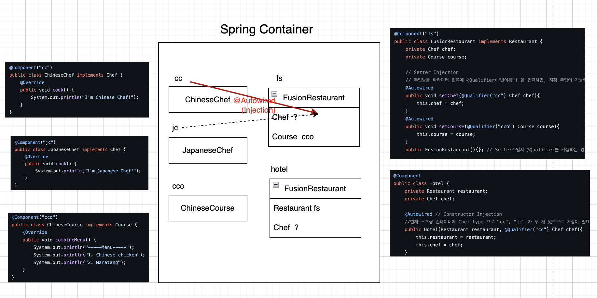

# Spring Core

## What is Spring Core?

The Spring Core is one of **Spring Modules.** (The Spring Boot is one of Spring Projects.)

The Spring Framework consists of features organized into about 20 modules. **Spring Modules are the building blocks of Spring Projects and Spring Framework.** They are what defined Spring Framework. These modules does not have to be used in full, but we can choose the modules that is needed in the application like Lego. That’s why the Spring Framework is considered as a lightweight container. Also, it is easy to make large-scale applications, because the modules can be just selected whenever it’s needed. 

Among others modules, Spring Core module is the most important and fundamental module. Since it provides the ‘core’ and fundamental parts of the framework, including **IoC and Dependency Injection features, it is the basis for other modules.** So, it promotes object-oriented design and focuses on improving application flexibility and scalability. 


:::tip
**What is Spring Module?**

The Spring Framework consists of features organized into about 20 modules. **Spring Modules are the building blocks of Spring Projects and Spring Framework.** They are what defined Spring Framework. These modules does not have to be used in full, but we can choose the modules that is needed in the application like Lego. 

That’s why the Spring Framework is considered as a lightweight container. Also, it is easy to make large-scale applications, because the modules can be just selected whenever it’s needed. 
:::


As you can see above, the *[Core Container](https://docs.spring.io/spring-framework/docs/4.3.13.RELEASE/spring-framework-reference/html/beans.html#beans-introduction)* consists of the `spring-core`, `spring-beans`, `spring-context`, `spring-context-support`, and `spring-expression` (Spring Expression Language) modules.

Understanding and leveraging this core module is key to understanding and leveraging the Spring Framework.

## The Journey of implementing IoC

I’ve already written a blog about how Spring implements IoC. Check here. In this article, I will deal with almost same concept, but with simple examples. Let’s take a closer look about why and how Spring support IoC & DI, with the real examples.

### Step 1. Pure Java Code, without implementing IoC

[Example Code - Chap01](https://github.com/serinryu/blog-example-code/tree/e7aabba90334c63d651994bc0983242fe09a95da/spring/core/src/main/java/com/spring/core/chap01)

1. Hotel class

Hotel class cannot function without Restaurant class and Chef class. In other words, Hotel is dependent on Restaurant class and Chef class.

```java
package com.spring.core.chap01;

public class Hotel {
    private Restaurant restaurant;
    private Chef chef;

    public Hotel(){
        restaurant = new FusionRestaurant();
        chef = new KoreanChef();
    }
}
```

- The object of class Hotel directly create the instances of class Restaurant and class Chef using the new operator. They are created inside the object of class Hotel with new operator.

1. FusionRestaurant 

FusionRestaurant class cannot function without Course class and Chef class. In other words, FusionRestaurant is dependent on Course class and Chef class.

```java
package com.spring.core.chap01;

public class FusionRestaurant implements Restaurant{
    private Chef chef;
    private Course course;

    public FusionRestaurant(){
        chef = new ChineseChef();
        course = new ChineseCourse();
    }
}
```

- The object of class FusionRestaurant directly create the instances of class Course and class Chef using the new operator. They are created inside the object of class FusionRestaurant with new operator.

The client program has the responsibility of not only using the objects, but also creating the objects. This occurs poor flexibility and scalability. Therefore, to address these problems, dependency injection is suggested. 

### Step 2. Pure Java Code, with implementing IoC yourself

**Dependency injection** is a technique of managing dependencies between objects, in which objects are created externally and then injected into them, **rather than directly creating them.** 

[Example Code - Chap02](https://github.com/serinryu/blog-example-code/tree/e7aabba90334c63d651994bc0983242fe09a95da/spring/core/src/main/java/com/spring/core/chap02)

1. Hotel class

```java
package com.spring.core.chap02;

public class Hotel {

    private Restaurant restaurant;
    private Chef chef;

    public Hotel(Restaurant restaurant, Chef chef){
        this.restaurant = restaurant;
        this.chef = chef;
    }
}
```

- The objects of class Restaurant and class Chef are created externally and injected in class Hotel.

1. FusionRestaurant class

```java
package com.spring.core.chap02;

public class FusionRestaurant implements Restaurant {
    private Chef chef;
    private Course course;

    public FusionRestaurant(Chef chef, Course course){
        this.chef = chef;
        this.course = course;
    }
}
```

- The objects of class Course and class Chef are created externally and injected in class FusionRestaurant.

1. Config file (HotelManager.java)

We made a Config file which is responsible to creating new objects. 

```java
package com.spring.core.chap02.config;

import com.spring.core.chap02.*;

public class HotelManager {
    public Chef chef(){
        return new KoreanChef();
    }
    public Course course(){
        return new KoreanCourse();
    }
    public Restaurant restaurant(){
        return new FusionRestaurant(chef(), course());
    }
    public Hotel hotel(){
        return new Hotel(restaurant(), chef());
    }
}
```

There are four methods to inject the dependencies. 

- 1) Constructor injection
- 2) Setter injection
- 3) Field injection
- 4) Method injection.

In above cases, DI is implemented by Constructor injection.

The conclusion is that we **could** implement DI ourselves (without help of Spring Framework)  **using various design patterns, such as the Factory pattern, Abstract Factory pattern, Builder pattern, Decorator pattern, and Service Locator pattern. 

The design pattern that we used above, is called ‘Factory pattern’. This pattern takes out the responsibility of creating the object from the client program to the factory class. It removes the instantiation of actual implementation classes from client code. Now it is possible to create object without exposing the creation logic to the client. 

- Factory Class : HotelManager(Config) is responsible for creating every new instance.
- Client Program : Hotel and FusionRestaurant are only responsible for using the instances. Now, they are NOT responsible for creating new instances.

It means that we can easily change class implementation since client program is unaware of this. It make out code more robust, less coupled and easy to extend.

**Why Spring Framework is helpful**

So far, we've learned what dependency injections are and why they're needed. As mentioned above, in the case of a very simple program, dependency injection can be implemented with writing codes by developers themselves. But what if there are dozens of classes that depend on each other? The developers are likely to make mistakes for sure.

Spring Framework simply implements these patterns internally, providing you with an infrastructure to use in a formalized way.

### Step 3. Implementing IoC by using **Spring Container and Beans**

In the previous code, the developer created the object manually, but now let’s use Spring Framework to carry out IoC easily. 

To implement IoC, just register the object as a spring bean in the spring container and find and use the spring bean in the spring container. Therefore, developers do not have to create objects with **new** operator, but simply 'register' the objects in the spring container and request the objects when it’s necessary.

**How it works**

1. 📦 Create Spring Container
2. 🫘 Create(Configure) Beans in Spring container 
3. 💉 Inject the dependency

### (1.a) 🫘 Configure Beans by using @Bean

The class annotated with `@Configuration` used by Spring Containers as a source of bean definitions. Therefore, this Config file is like Spring Container. Also, `@Bean` means that the method is a Spring Bean to be managed by Spring Container.

> @**Bean**: This way you define your beans manually inside @Configuration class.


```java
package com.spring.core.chap03.config;

import com.spring.core.chap03.*;
import org.springframework.context.annotation.Bean;
import org.springframework.context.annotation.Configuration;

@Configuration
public class HotelConfig {

    @Bean
    public Chef chef(){
        return new KoreanChef();
    }

    @Bean
    public Course course(){
        return new KoreanCourse();
    }

    @Bean
    public Restaurant restaurant(){
        return new FusionRestaurant(chef(), course());
    }

    @Bean
    public Hotel hotel(){
        return new Hotel(restaurant(), chef());
    }
}
```

Let’s test it! `AnnotationConfigApplicationContext ac = new AnnotationConfigApplicationContext(HotelConfig.class);` creates a Spring Container called ‘ac’. After that, if we want to use it, we can just bring the bean inside the Spring Container.

```java
public class HotelConfigTest {

    // Create a Spring Container, 'ac'.
    AnnotationConfigApplicationContext ac = new AnnotationConfigApplicationContext(HotelConfig.class);

    // Get Bean from Spring Container
    @Test
    void springDITest(){
        Hotel hotel = ac.getBean(Hotel.class);
        // hotel.inform();
        Chef chef = ac.getBean(Chef.class);
        // chef.cook();
    }
}
```

[Example Code - Chap03](https://github.com/serinryu/blog-example-code/tree/e7aabba90334c63d651994bc0983242fe09a95da/spring/core/src/main/java/com/spring/core/chap03)

### (1.b) 🫘 Or Configure Beans by using @Component

 This Config file is like Spring Container. But here, we use @ComponentScan instead of @Bean. If we configures every bean one by one with @Bean annotation, the Config file(class) would be too complicated. That’s where @ComponentScan comes in. 

> @**ComponentScan**: You enable auto-scanning (default using current folder path), optionally you can specify an basePackage where spring will found yours beans.
> 

> **@Component:** It is a class-level annotation. It is used to mark a Java class as a bean.
> 

```java
package com.spring.core.chap04.config;

import org.springframework.context.annotation.ComponentScan;
import org.springframework.context.annotation.Configuration;

@Configuration
@ComponentScan(basePackages = "com.spring.core.chap04") // component scan 의 범위
  public class HotelAutoConfig {
}
```

### (2) 💉 Inject the dependencies by using @Autowired

`@Autowired` annotations help the Spring container identify the dependencies and wire them appropriately. Also, Spring Framework ***could support*** these four methods that is generally used for DI. With `@Autowired`, you can inject the dependencies selecting one of the following methods.

1) Constructor injection

2) Setter injection

3) Field injection

4) Method injection

However, it's worth mentioning that field injection is generally considered less preferable compared to constructor injection or setter injection, as it can lead to issues with testability and can make the code less readable.

- Option 1. Field-injected DI

```java
package com.spring.core.chap04;

import org.springframework.beans.factory.annotation.Autowired;
import org.springframework.stereotype.Component;

@Component
public class Hotel {
	
	// field-injected DI
    @Autowired 
    private Restaurant restaurant;
    @Autowired
    private Chef chef; 

    public Hotel(Restaurant restaurant, Chef chef){
        this.restaurant = restaurant;
        this.chef = chef;
    }
}
```

[Example Code - Chap04](https://github.com/serinryu/blog-example-code/blob/e7aabba90334c63d651994bc0983242fe09a95da/spring/core/src/main/java/com/spring/core/chap04/Hotel.java)


As a result, Spring injects Restaurant and Chef when Hotel is created. 


- Option 2. Constructor-injected DI

```java
package com.spring.core.chap05;

import org.springframework.beans.factory.annotation.Autowired;
import org.springframework.beans.factory.annotation.Qualifier;
import org.springframework.stereotype.Component;

@Component
public class Hotel {
    private Restaurant restaurant;
    private Chef chef;

		// Constructor-injected DI
		@Autowired 
		public Hotel(Restaurant restaurant, Chef chef){
        this.restaurant = restaurant;
        this.chef = chef;
    }
}
```

[Example Code - Chap05](https://github.com/serinryu/blog-example-code/blob/e7aabba90334c63d651994bc0983242fe09a95da/spring/core/src/main/java/com/spring/core/chap05/Hotel.java)


- Option 3. Setter-injected DI
  
```java
package com.spring.core.chap05;

import org.springframework.beans.factory.annotation.Autowired;
import org.springframework.beans.factory.annotation.Qualifier;
import org.springframework.stereotype.Component;

@Component
public class Hotel {
    private Restaurant restaurant;
    private Chef chef;

		// Setter-injected DI
		@Autowired 
		public void setRestuarant(Restaurant restaurant){
        this.restaurant = restaurant;
        }
        @Autowired 
		public void setChef(Chef chef){
				this.chef = chef;
		}
}
```

:::caution
The @Autowired annotation is a great way of making the need to inject a dependency in Spring explicit. Although it's useful, if more than one bean of the same type is available in the container, the framework will throw NoUniqueBeanDefinitionException.

By using the @Qualifier annotation, we can eliminate the issue of which bean needs to be injected.

Check out the picture below with [Example Code](https://github.com/serinryu/blog-example-code/blob/e7aabba90334c63d651994bc0983242fe09a95da/spring/core/src/main/java/com/spring/core/chap05/Hotel.java)
:::
